**FEMFFUSION**: a finite element method code for nuclear reactor modelling  

```
      ___  ___  _   _  ___  ___  _ _  __  _  _  _  _   
     | __|| __|| \_/ || __|| __|| | |/ _|| |/ \| \| |  
     | _| | _| | \_/ || _| | _| | U |\_ \| ( o ) \\ |  
     |_|  |___||_| |_||_|  |_|  |___||__/|_|\_/|_|\_|  
     
                    BASIC VERSION   1.0  
```
[**FEMFFUSION**](https://femffusion.webs.upv.es/) is an open source C++ neutronic code that solves the multigroup neutron transport equation using the diffusion approximation or the SPN approximation. The code uses the continuous Galerkin finite element method to be able to deal with any type of geometry and problem dimension (1D, 2D and 3D problems). It works on top of [deal.II](https://www.dealii.org/) library, which provides supporting and advances in the finite element method. 

**FEMFFUSION** main features are:
- Open source software (released under the terms of the [GNU GPL version 3](http://www.gnu.org/copyleft/gpl.html)).
- It works under GNU/Linux. Windows or macOS are not supported
- Use of the FEM to solve the multigroup neutron diffusion (or SPN) equations
- Use of matrix-free technique to maintain reasonable memory demands.
- Possibility to use and implement a variety of eigenvalue solvers and preconditioners.
- Valid for all types of geometries: rectangular, hexagonal, pin-level, and unstructured.
- Possibility to import unstructured grids from [GMsh](http://gmsh.info/)
- Capacity to solve problems in 1D, 2D, and 3D.
- Solve the direct or the adjoint flux and several eigenpairs, if requested
- Time-dependent problems such as control rod movements, noise problems, custom time-dependent cross sections, etc.
- Frequency domain analysis of noise problems.
- Output provides the keff, the map of the averaged neutron power per assembly, and each of the fluxes. Also, standard .vtk files are provided among other output formats. For time-dependent problems, the neutron power and the neutron fluxes are provided at each time step.
- Interacts with high-quality open-source libraries: deal.II, PETSc, SLEPc, Sundials, etc.
- Easy interface with plotting and post-processing tools (Matlab, ParaView, Matplotlib, etc.)
- Well documented and easy to extend to related problems


Actually, *FEMFFUSION* can be seen as deal.II specialization for the neutron transport equation that uses large sparse matrix solvers ([SLEPc](http://www.grycap.upv.es/slepc/) among others). That is to say, *FEMFFUSION* builds the matrices  and  that cast the multigroup neutron transport/diffusion equation as a matrix-based eigenvalue problem:

$$
L \phi = \frac{1}{k_{eff}} M \phi
$$

These matrices are expected to be sparse, as they are the result of the discretization of the differential transport operator using the finite element method, over a certain spatial grid either. Said matrices are thus built in [PETSc](http://www.mcs.anl.gov/petsc/) format, so they can either be passed to a solver (default is [SLEPc](http://www.grycap.upv.es/slepc/), whose algorithms and parameters may be chosen at run-time). 

*FEMFFUSION* also provides a second glue layer that links the output of the linear/eigen-solver to the input of a post-processing tool ([ParaView](http://www.paraview.org/) ). The effective multiplication factor, keff, is shown in the output file along with the fluxes and power distribution.

## Table of Contents
- [Overview](#femffusion-a-finite-element-method-code-for-nuclear-reactor-modelling)
- [Citing](#citing)
- [Install](#install)
- [Problem with parallel jobs](#problem-with-paralel-jobs)
- [Examples](#examples)
- [Further information](#further-information)
- [License](#license)

 
# Citing

*FEMFFUSION* is open software but if you use it, consider citing:
```
@article{FEMFFUSION2024,
  title = {FEMFFUSION and its verification using the C5G7 benchmark},
  volume = {196},
  ISSN = {0306-4549},
  url = {http://dx.doi.org/10.1016/j.anucene.2023.110239},
  DOI = {10.1016/j.anucene.2023.110239},
  journal = {Annals of Nuclear Energy},
  publisher = {Elsevier BV},
  author = {Fontenla,  Y. and Vidal-Ferràndiz,  A. and Carreño,  A. and Ginestar,  D. and Verdú,  G.},
  year = {2024},
  month = feb,
  pages = {110239}
}
```

# Install

*FEMFFUSION* works under GNU/Linux. Windows or macOS are not supported.Currently it works for Ubuntu 24.04 apt packages PETSC 3.19, SLEPC 3.19, deal.ii 9.5.1.
For other Linux distributions might work using the same libraries.

First, install some important tools and libraries by typing in the terminal:

```
sudo apt-get install make autoconf automake gcc g++ git findutils cmake
sudo apt-get install libdeal.ii-dev petsc-dev slepc-dev
sudo apt-get install gmsh gnuplot paraview 
```

Then, clone the repository and build it.
```
git clone https://github.com/Zonni/FEMFFUSION.git
cd femffusion
cmake .
make release
make -j$(nproc) 
```

To run a problem, you can type
```
./femffusion.exe -f reactorfolder/file.prm
```
For example,
```
./femffusion.exe -f examples/2D_BIBLIS/biblis_SP3.prm
```

If you have any problem, you can contact [anvifer2@upv.es](mailto:anvifer2@upv.es).

# Problem with parallel jobs

In some computers FEMFFUSION is using all available cores even though this is not requested. To avoid it, run FEMFFUSION as:
```
mpirun -n 1 ./femffusion.exe -Other_parameters
```
Or, you can export the following environment variable before using the program:
```
export OMP_NUM_THREADS=1
```

# Examples 

After the successful compilation of the code one recommended step is to run the tests by: 
```
./femffusion.exe -t
```

Also, you can run the examples by:
```
./run_examples.sh
```

The examples consist of a set of nuclear reactors:

 1. **1D**; Example of a homogeneous slab of 2cm solved with vacuum, zero current and zero flux boundary conditions. A pedagogical example to see the improvement between diffusion, SP3 and SP5, and transport methods.

| 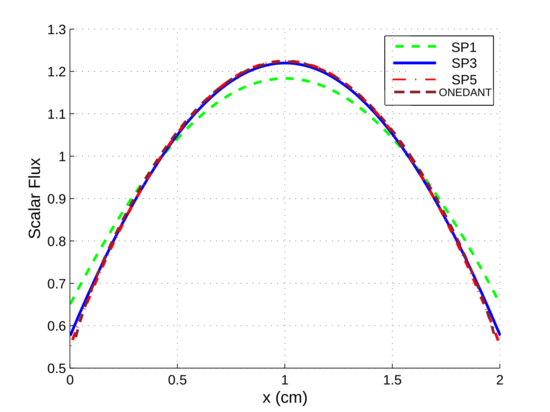 |
|:------------------------------------------:|
| 1st Mode                                   |

 2. **2D_BIBLIS**; Classic neutron diffusion benchmark with a characteristic chess board pattern. Solved with SP1, SP3 and SP5 approximations.

  
| 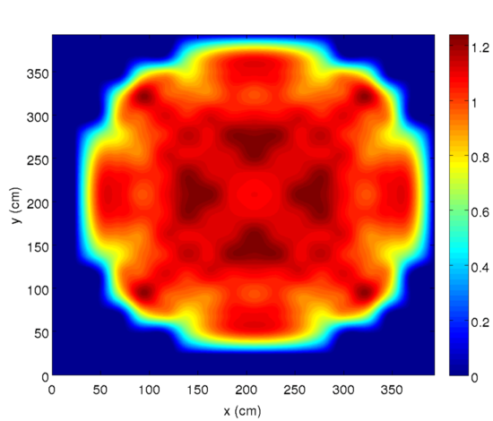  |    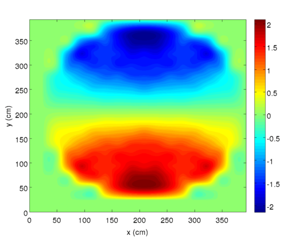|
|:----------:|:-------------:|
| 1st Mode |  2nd Mode  |
| 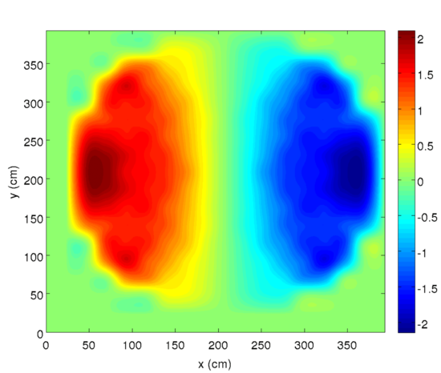  |    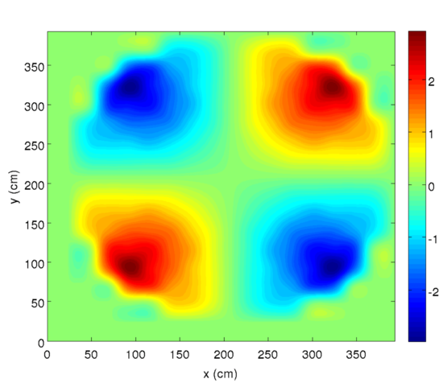|
| 3rd Mode |  4th Mode  |
 
 3. **2D_C5G7**: The NEA 2D benchmark on deterministic transport
calculations without spatial homogenization. The description can be found [here](https://www.oecd-nea.org/science/docs/2003/nsc-doc2003-16.pdf).

| 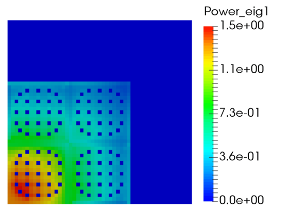  |    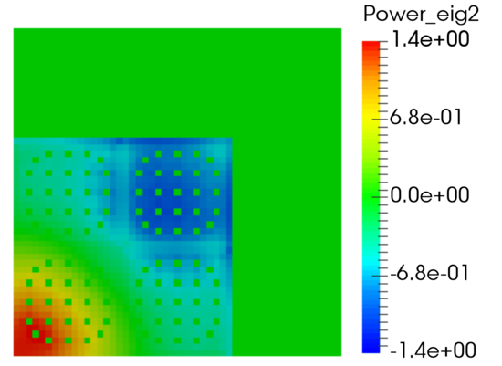|
|:----------:|:-------------:|
| 1st Mode |  2nd Mode  |
| 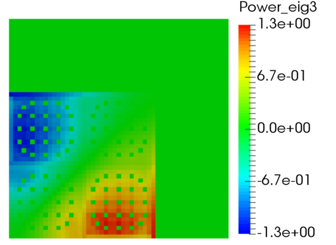  |    |
| 3rd Mode |  4th Mode  |

 4. **2D_VVER440**: A hexagonal two dimensional benchmark.

| 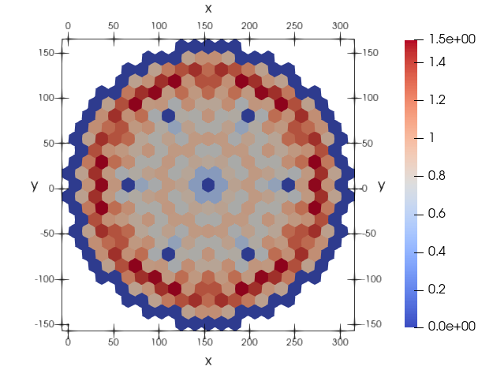  |    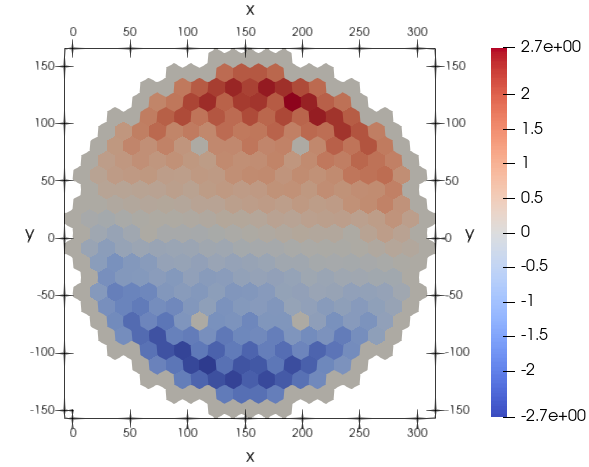|
|:----------:|:-------------:|
| 1st Mode |  2nd Mode  |
| 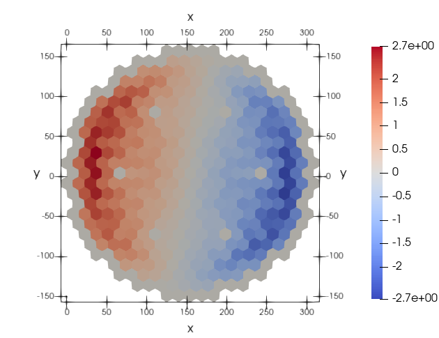  |    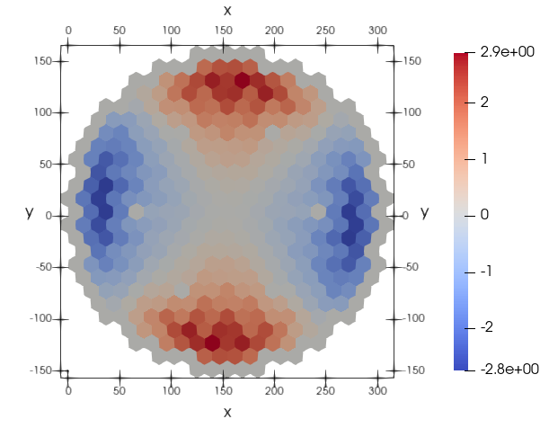|
| 3rd Mode |  4th Mode  |

 5. **3D_IAEA**: A classic 3D benchmark with rectangular geometry. The description can be found [here](https://engineering.purdue.edu/PARCS/Code/TestSuite/CalculationMode/StandAloneMode/Eigenvalue/IAEA3DPWR).

| 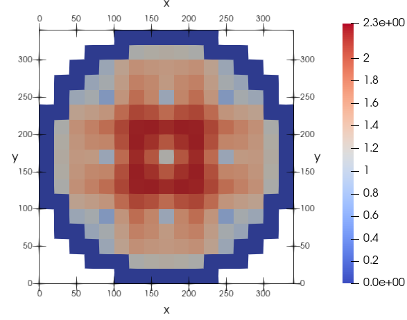  |    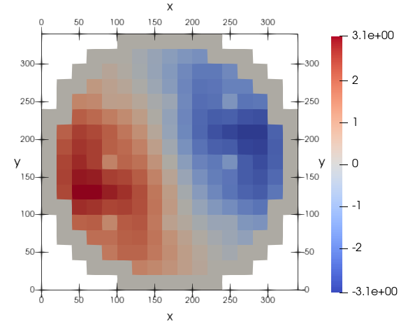|
|:----------:|:-------------:|
| 1st Mode |  2nd Mode  |
| 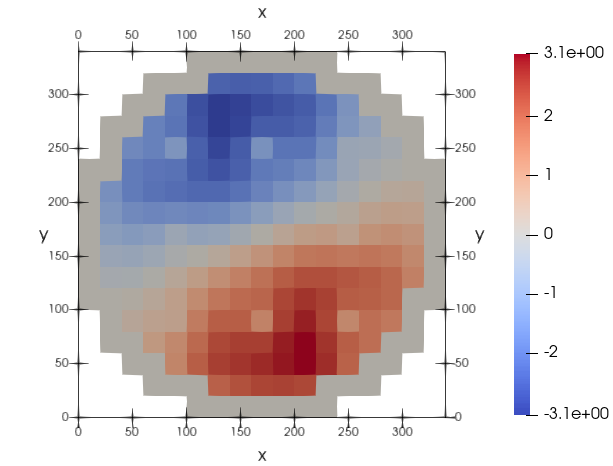  |    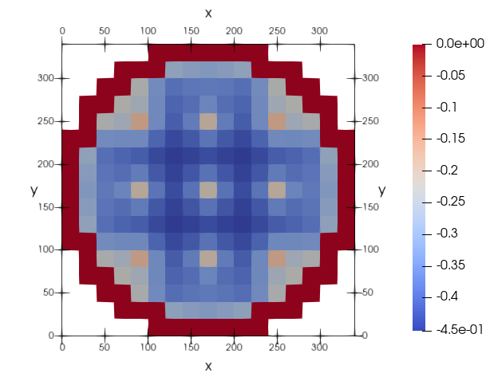|
| 3rd Mode |  4th Mode  |
 
 6. **3D_Langenbuch**: Other classic 3D benchmark.

| 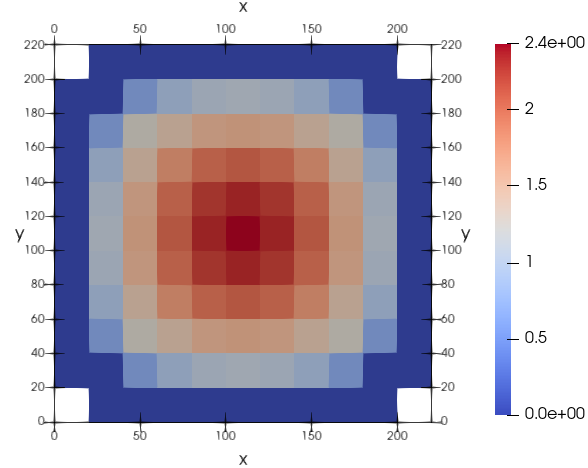 |
|:------------------------------------------:|
| 1st Mode                                   |

 7. **3D_VVER440**: A hexagonal 3D benchmark.

| 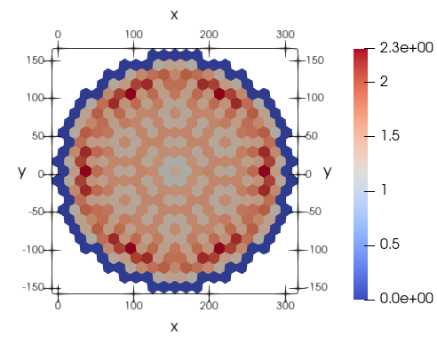 |
|:------------------------------------------:|
| 1st Mode                                   |


# Further information


Repository: <https://github.com/Zonni/FEMFFUSION><br>
Authors: Antoni Vidal-Ferràndiz, Amanda Carreño, Damian Ginestar and Gumersindo Verdú.<br>
Universitat Politècnica de València<br>
Contact: [anvifer2@upv.es](mailto:anvifer2@upv.es)

# License

*FEMFFUSION* is licensed under [GNU GPL version 3](http://www.gnu.org/copyleft/gpl.html).<br>
*FEMFFUSION* is  [free software](https://www.gnu.org/philosophy/free-sw.html): you are free to change and redistribute it.
There is NO WARRANTY.

<p align="center">
  
  
  
  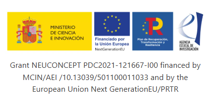
</p>
V_principal_color.png" height="80"/>
  
  
  
</p>

